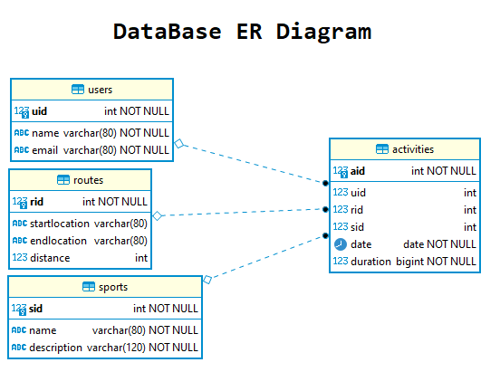

# Relatório técnico da Fase 1

## Introdução

Este documento contém os aspectos relevantes do desenho e implementação da fase 1 do projecto de LS.

## Modelação da base de dados

### Modelação conceptual ###

O seguinte diagrama apresenta o modelo entidade-associação para a informação gerida pelo sistema. 



Destacam-se os seguintes aspectos deste modelo:

* Existem 4 relações neste modelo, com objetivo de registar actividades desportivas e sua duração:
    * A relação `routes` é composta pelos atributos `startlocation`, `endlocation` e `distance` sendo os dois primeiros do tipo `varchar(80)` e o ultimo do tipo `int`. A chave primária é assegurada pelo atributo `rid` sendo este do tipo `serial` (auto-incrementável). 
    
    * A relação `sports` é composta pelos atributos `name` e `description` sendo o primeiro do tipo `varchar(80)` e o ultimo do tipo `varchar(120)`. A chave primária é assegurada pelo atributo `sid` sendo este do tipo `serial` (auto-incrementável).
    
    * A relação `users` é composta pelos atributos `name` e `email` sendo ambos do tipo `varchar(80)`. A chave primária é assegurada pelo atributo `uid` sendo este do tipo `serial` (auto-incrementável) .
    
    * A relação `activities` é composta pelos atributos `uid`, `sid`, `rid`, `date` e `duration` sendo os três primeiros chaves estrangeiras para outras relações e do tipo `inteiro` enquanto que o atributo `date` é do tipo `date` e o atributo `duration` pela necessidade de armazenar informação ao milisegundo foi definido como sendo do tipo `bigint`.


O modelo conceptual apresenta ainda as seguintes restrições:

* Na relação `users` atributo `email` contém a restrição `unique` por forma a assegurar que não existem duplicados do mesmo.
* Na relação  `activities`:
    * `sid` é referência para a chave primária da relação `sports.sid`
    
    * `uid` é referência para a chave primária da relação `users.uid`
    
    * `rid` é referência para a chave primária da relação `routes.rid` sendo este atributo facultativo (`NULL`) pois a actividade não obriga à associação de uma rota pre-existente.
    
### Modelação física ###

O modelo físico da base de dados está presente em ([SQL Script](../src/scripts/sql/createSchema.sql)).

Destacam-se os seguintes aspectos deste modelo:

* A script de criação do modelo de dados define as tabelas/relações apenas se estas não estiverem presentes na base de dados.

## Organização do software

### Processamento de comandos

Para o processamento de comandos é criada a classe `Request` fazendo o `parse` da `String` recebida. Este request 
separa a String nas suas propriedades como por exemplo `method`, path, etc...
Por sua vez, esse Request é passado ao Router para encontrar a route e executar o handler correspondente.

### Encaminhamento dos comandos

A verificação da instrução é realizada pelo método `findRoute` da classe `Router` que recebe o request 
referido na secção anterior e o processa percorrendo uma árvore n-ária definida com todos os caminhos possíveis
 registados na aplicação. 
Esta árvore começa com o primeiro nível a corresponder ao `method` e os seguintes níveis a todas a subdivisões do `path`,
estas subdivisões podem ser variáveis o que faz com que o nó correspondente fique com um boleano de variavel a verdadeiro.
Concluida a validação, é executado o metodo `execute` do ultimo nó encontrado passando o request como argumento. 
Finalmente o nó que recebe o request, verifica o método e também a existência de parâmetros 
executanto o metodo correspondente à chamada assim que validado.


### Gestão de ligações

Cada modelo é responsável por pedir a criação de um novo datasource ao package Utils, realizar as queries necessárias 
ao seu propósito e finalmente encerrar todas as ligações que possa ter com o datasource.

### Acesso a dados

Foi desenvolvidas classes para representar cada area do problema, nomeadamente user, sports, activities e routes de modo
a abstrair a obtenção de dados da base de dados. Estas classes devolvem sempre representações unitárias de uma identidade
como por exemplo, a classe UserModel irá sempre retornar instâncias de User.  

Na maioria dos casos, as queries são de sintaxe trivial. Nas inserções, de forma a retornar uma representação unitária, 
é feita uma query extra para procura da entrada acabada de inserir.

### Processamento de erros

Foram criadas exceções adicionais para dados inválidos que sejam introduzidos pelo utilizador como por exemplo:

* Pedido de uma rota inexistente
* Envio de parâmetros errados ou formato errado
* Falhas de acesso à base de dados

Todos estas exceções têm uma mensagem que é apresentada ao utilizador.

## Avaliação crítica

Fazer com que os modelos recebam os tipos de argumentos corretos e serem as views a validar e modificar para o tipo correto
os dados que venham do utilizador.
Criar uma maior abstração na criação de views com objetivo de diminuir a complexidade do `execute`.


O processamento de pedidos é implentado através da interface `RequestHandler` que define o método `execute` 
que retorna um `RequestResult` que contém os dados da resposta ao comando solicitado.

As classes `ActivitiesView`, `RoutesView`, `SportsView` e `UsersView` implementam a interface 
`RequestHandler` recebendo um pedido(`Request`) que irá conter o `method` o `path` e eventualmente 
`parameters` com a seguinte estrutura:
> ``` {method} {path} {parameters} ```


Os argumentos recebidos no request são :

* Obtidos com recurso ao método `parseRequest` da class `App` que separa os comandos recebendo uma 
`String` e com recurso ao método `split` o divide nos vários componentes validado também se a sua 
composição contém um número válido de argumentos (2 ou 3).

* A verificação da instrução é realizada pelo método `findRoute` da classe `Router` que recebe o 
request e o processa percorrendo uma árvore n-ária definida com todos os caminhos possíveis registados 
na aplicação. Concluida a validação, é executado o metodo `execute` do ultimo nó encontrado passando o request 
como argumento.
