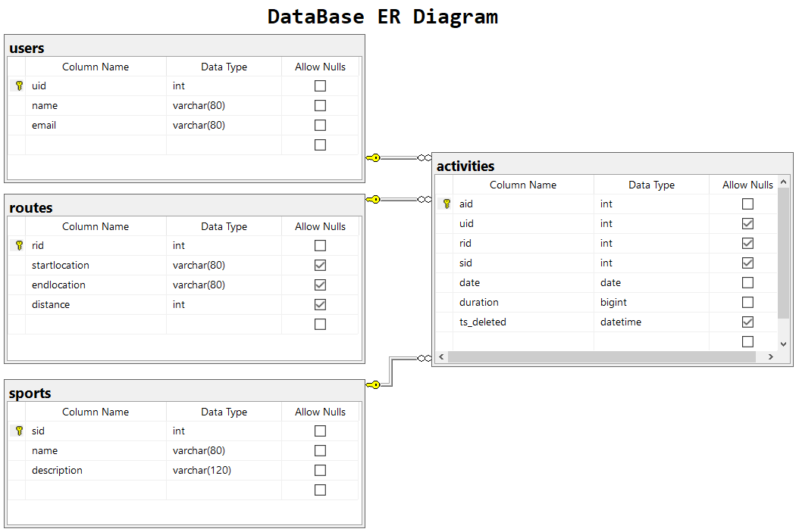
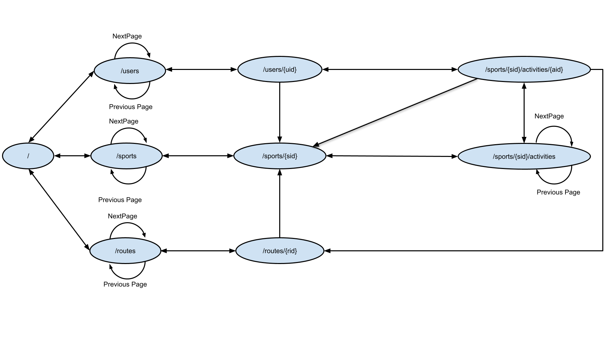

# Relatório técnico da Fase 2

## Introdução

Este documento contém os aspetos relevantes do desenho e implementação da fase 3 do projecto de Laboratório de Software.

## Modelação da base de dados

### Modelação conceptual ###

O seguinte diagrama apresenta o modelo entidade-associação para a informação gerida pelo sistema. 

Destacam-se os seguintes aspectos deste modelo:

* Existem 4 relações neste modelo, com objetivo de registar actividades desportivas e sua duração:
    * A relação `routes` é composta pelos atributos `startlocation`, `endlocation` e `distance` sendo os dois primeiros do tipo `varchar(80)` e o ultimo do tipo `int`. A chave primária é assegurada pelo atributo `rid` sendo este do tipo `serial` (auto-incrementável). 
    
    * A relação `sports` é composta pelos atributos `name` e `description` sendo o primeiro do tipo `varchar(80)` e o ultimo do tipo `varchar(120)`. A chave primária é assegurada pelo atributo `sid` sendo este do tipo `serial` (auto-incrementável).
    
    * A relação `users` é composta pelos atributos `name` e `email` sendo ambos do tipo `varchar(80)`. A chave primária é assegurada pelo atributo `uid` sendo este do tipo `serial` (auto-incrementável) .
    
    * A relação `activities` é composta pelos atributos `uid`, `sid`, `rid`, `date`, `duration` e `ts_deleted` sendo os 
    três primeiros chaves estrangeiras para outras relações e do tipo `inteiro` enquanto que o atributo `date` 
    é do tipo `date` e o atributo `duration` pela necessidade de armazenar informação ao milisegundo foi definido 
    como sendo do tipo `bigint`. Na segunda fase do projeto foi adicionado o atributo `ts_deleted` para designar que e
    quando um registo é eliminado. A eliminação não é fisica mas o registo fica com essa identificação pelo que não surgirá
    listado nas consultas à relação.

O modelo conceptual apresenta ainda as seguintes restrições:

* Na relação `users` atributo `email` contém a restrição `unique` por forma a assegurar que não existem duplicados do mesmo.
* Na relação  `activities`:
    * `sid` é referência para a chave primária da relação `sports.sid`
    
    * `uid` é referência para a chave primária da relação `users.uid`
    
    * `rid` é referência para a chave primária da relação `routes.rid` sendo este atributo facultativo (`NULL`) pois a actividade não obriga à associação de uma rota pre-existente.
    
### Modelação física ###

O modelo físico da base de dados está presente em ([SQL Script](../src/scripts/sql/createSchema.sql)).

Destacam-se os seguintes aspectos deste modelo:

* A script de criação do modelo de dados define as tabelas/relações apenas se estas não estiverem presentes na base de dados.

## Organização do software

### Processamento de comandos

Para o processamento de comandos foi criada a classe `Request` que realiza o `parse` da `String` recebida. Este `parse` 
separa a `String` nas suas propriedades como por exemplo `method`, `path`, etc...
Por sua vez, o Request é passado ao Router para encontrar a route e executar o handler correspondente.
Na segunda fase de implementação do projeto, optou-se pela aproximação a um modelo MVC em que cada classe handler 
passou a ser uma implementação da Interface RequestHandler. 
 A interface RequestHandler impõe a implementação do método `execute` que por sua vez retorna um Optional do tipo 
 RequestResult após a chamada do método correspondente do modelo, que é responsável pela execução de comandos na base de
 dados.
 
 A segunda fase do projeto requeria a implementação de metodos de visualização dos dados nos formatos HTML, JSON e Plain Text
 a qual foi realizada através do desenvolvimento das classes correspondentes para cada uma das entidades e para cada um dos
 formatos sendo que todos implementam a Interface `View` que impõe o metodo `getRepresentation`. 

### Encaminhamento dos comandos

A verificação da instrução é realizada pelo método `findRoute` da classe `Router` que recebe o request 
referido na secção anterior e o processa percorrendo uma árvore n-ária definida com todos os caminhos possíveis registados na aplicação. 
Esta árvore começa com o primeiro nível a corresponder ao `method` e os seguintes níveis a todas a subdivisões do `path`,
como as subdivisões podem conter valores variáveis, foi criado uma flag boleana que ao ser verdadeira ignora a pesquisa do valor na àrvore pois este
será um parâmetro a fornecer a quando da execução do metodo.
Concluida a validação, é executado o metodo `execute` do ultimo nó encontrado passando o request como argumento. 
Finalmente o nó que recebe o request, verifica o método e também a existência de parâmetros 
executanto o metodo correspondente à chamada assim que validado.

### Gestão de ligações

Foi criado um TransactionManager de modo que a gestão de coneções a base de dados fique centralizado numa classe.
Esta classe tem o método execute que recebe um interface Operation que é implementada através de uma função lamda.  

### Acesso a dados

Foram desenvolvidas classes para representar cada área do problema, nomeadamente `user`, `sports`, `activities` e `routes`, 
alocadas ao package `model`, de modo a abstrair as transações de dados da base de dados. Estas classes devolvem 
sempre representações unitárias de uma identidade como, por exemplo, a classe `UserModel` irá sempre retornar instâncias de `User`.

Na maioria dos casos, as queries são de sintaxe trivial. Nas inserções, de forma a retornar uma representação unitária, 
é feita uma query extra para procura da entrada acabada de inserir.

### Servidor HTTP

Foi implementada através da biblioteca HttpServlet um servidor HTTP para resposta a pedidos de HTTP, tipicamente via browser.
Fizeram-se as alterações necessárias para implementação do fluxo do seguinte grafo:
Este servidor aceita pedidos com os métodos GET, POST. Pedidos POST fazem um redirecionamento para as pagina especificas criadas. 
Exemplo: Quando criamos um user através da chamada POST /users envia um status code 303 com o header Location: GET /users/{id_created}

### Processamento de erros

Foram criadas exceções adicionais para dados inválidos que sejam introduzidos pelo utilizador como, por exemplo:

* Pedido de uma rota inexistente.
* Envio de parâmetros errados ou formato errado
* Falhas de acesso à base de dados.

Todos estas exceções têm uma mensagem que é apresentada ao utilizador.

## Avaliação crítica

Implementar uma maior quantidade e variedade de testes.
