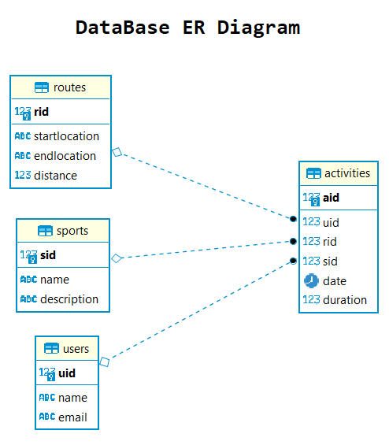

# Relatório técnico da Fase 1

## Introdução

Este documento contém os aspectos relevantes do desenho e implementação da fase 1 do projecto de LS.

## Modelação da base de dados

### Modelação conceptual ###

O seguinte diagrama apresenta o modelo entidade-associação para a informação gerida pelo sistema. 



Destacam-se os seguintes aspectos deste modelo:

* Existem 4 relações neste modelo, com objetivo de registar actividades desportivas e sua duração:
    * A relação `routes` é composta pelos atributos `startlocation`, `endlocation` e `distance` sendo os dois primeiros do tipo `varchar(80)` e o ultimo do tipo `int`. A chave primária é assegurada pelo atributo `rid` sendo este do tipo `serial` (auto-incrementável). 
    
    * A relação `sports` é composta pelos atributos `name` e `description` sendo o primeiro do tipo `varchar(80)` e o ultimo do tipo `varchar(120)`. A chave primária é assegurada pelo atributo `sid` sendo este do tipo `serial` (auto-incrementável).
    
    * A relação `users` é composta pelos atributos `name` e `email` sendo ambos do tipo `varchar(80)`. A chave primária é assegurada pelo atributo `uid` sendo este do tipo `serial` (auto-incrementável) .
    
    * A relação `activities` é composta pelos atributos `uid`, `sid`, `rid`, `date` e `duration` sendo os três primeiros chaves estrangeiras para outras relações e do tipo `inteiro` enquanto que o atributo `date` é do tipo `date` e o atributo `duration` pela necessidade de armazenar informação ao milisegundo foi definido como sendo do tipo `bigint`.


O modelo conceptual apresenta ainda as seguintes restrições:

* Na relação `users` atributo `email` contém a restrição `unique` por forma a assegurar que não existem duplicados do mesmo.
* Na relação  `activities`:
    * `sid` é referência para a chave primária da relação `sports.sid`
    
    * `uid` é referência para a chave primária da relação `users.uid`
    
    * `rid` é referência para a chave primária da relação `routes.rid` sendo este atributo facultativo (`NULL`) pois a actividade não obriga à associação de uma rota pre-existente.
    
### Modelação física ###

O modelo físico da base de dados está presente em ([SQL Script](../src/scripts/sql/createSchema.sql)).

Destacam-se os seguintes aspectos deste modelo:

* A script de criação do modelo de dados define as tabelas/relações apenas se estas não estiverem presentes na base de dados.

## Organização do software

### Processamento de comandos

O processamento de pedidos é implentado através da interface `RequestHandler` que define o método `execute` que retorna um `RequestResult` que contém os dados da resposta ao comando solicitado.

As classes `ActivitiesView`, `RoutesView`, `SportsView` e `UsersView` implementam a interface `RequestHandler` recebendo um pedido(`Request`) que irá conter o `method` o `path` e eventualmente `parameters` com a seguinte estrutura:
> ``` {method} {path} {parameters} ```

Ao receber o request, é verificado o metodo e também a existência de parâmetros executanto o metodo correspondente à chamada assim que validado.

Os argumentos recebidos no request são :

* Obtidos com recurso ao método `parseRequest` da class `App` que separa os comandos recebendo uma `String` e com recurso ao método `split` o divide nos vários componentes validado também se a sua composição contém um número válido de argumentos (2 ou 3).

* A verificação da instrução é realizada pelo método `findRoute` da classe `Router` que recebe o request e o processa percorrendo uma árvore n-ária definida com todos os caminhos possíveis existentes na aplicação. Concluida a validação, é executado o metodo `execute` do ultimo nó encontrado.


### Encaminhamento dos comandos

(_describe how the router works and how path parameters are extracted_)

### Gestão de ligações

(_describe how connections are created, used and disposed_, namely its relation with transaction scopes).

### Acesso a dados

(_describe any created classes to help on data access_).

(_identify any non-trivial used SQL statements_).

### Processamento de erros

(_describe how errors are handled and communicated to the application user_).

## Avaliação crítica

(_enumerate the functionality that is not concluded and the identified defects_)

(_identify improvements to be made on the next phase_)
